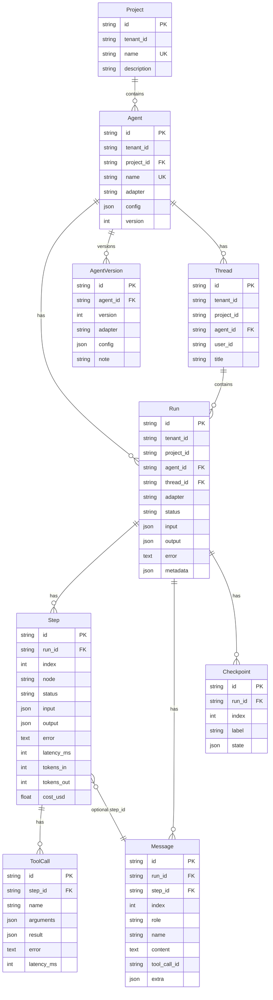
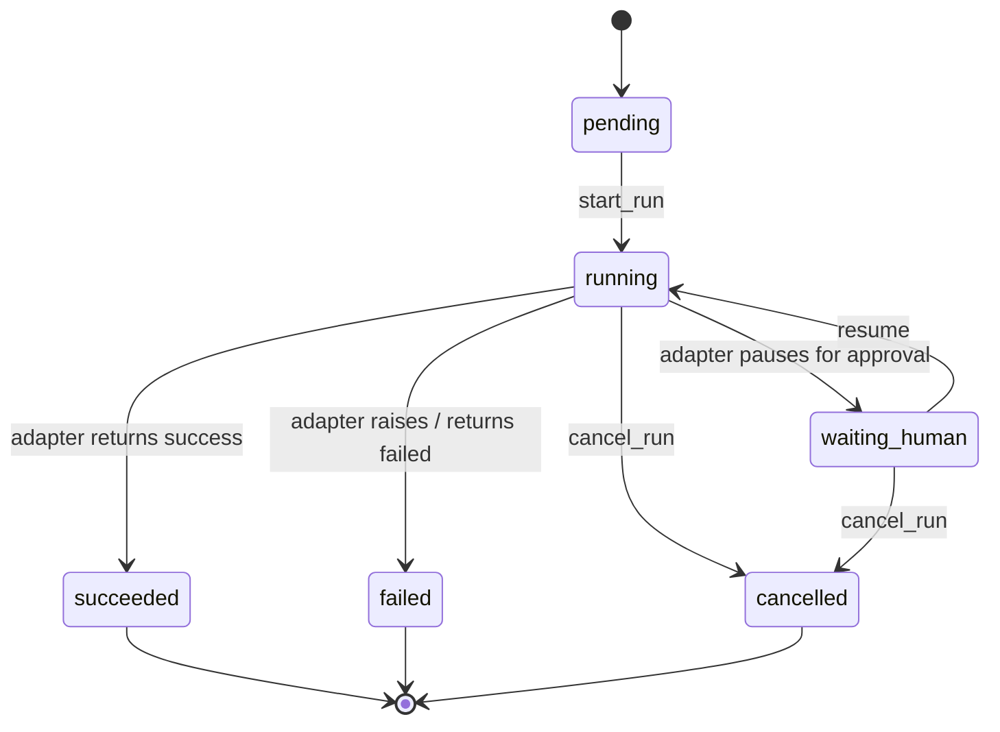

# Data model

AgentFlow stores every adapter execution in a small set of tables. The shape
is deliberately framework-agnostic so a single UI and SDK can render any
agent system.

## Entities

## Status state machine

## Design notes

- **`tenant_id` is the organization id.** Projects belong to one organization;
  agents and runs persist their `project_id` so authorization remains stable
  across the Run lifecycle. A key can be organization-, project-, or
  Agent-scoped; inaccessible sibling resources return 404.
- **`Agent.version`** is a monotonic integer. Each bump also writes an
  immutable ``agent_versions`` snapshot (adapter + config + description).
  Restore creates a new version rather than rewriting history.
- **`metadata` is a JSON column** named `metadata_` in Python because
  `metadata` is reserved on `DeclarativeBase`. The column on disk is still
  `metadata`.
- **`Checkpoint.state` is opaque to the runtime.** Each adapter decides how
  to encode resumable state (LangGraph snapshot bytes encoded as JSON,
  AutoGen conversation, custom state machines).
- **`Step.index` is monotonic per run.** Use it for ordering instead of
  `created_at` so retries and replays stay stable.
- **`Message.step_id` is optional** so an adapter can attach a message to a
  specific node tick when it makes sense, while keeping the run-level
  ordering authoritative.
- **`Thread` groups Runs for L1 short memory.** `Run.thread_id` is optional;
  when set, the worker seeds `AdapterContext.thread_messages` from prior runs
  in the same thread (window-trimmed). Messages remain Run-scoped rows.
- **`ToolCall.id` is the lifecycle association key.** SSE
  ``tool_call.started`` / ``tool_call.completed`` carry the same ``call_id``
  (equal to ``ToolCall.id``) so parallel or same-name tool invocations within
  one step do not clobber each other.

## Indexes

| Index | Purpose |
| --- | --- |
| `uq_agents_tenant_name` | unique agent name per tenant |
| `ix_agents_tenant_id` | list agents for a tenant |
| `ix_agents_project_id` | apply project-scoped access to agents |
| `uq_projects_tenant_name` | unique project name per organization |
| `ix_projects_tenant_id` | list projects for an organization |
| `ix_runs_tenant_id` | filter runs by tenant |
| `ix_runs_project_id` | apply project-scoped access to runs |
| `ix_runs_thread_id` | list / join runs by conversation thread |
| `ix_threads_tenant_id` | list threads for a tenant |
| `ix_threads_tenant_agent` | filter threads by tenant + agent |
| `ix_threads_agent_id` | cascade / lookup threads by agent |
| `ix_runs_tenant_created` | tenant-scoped recent runs |
| `ix_runs_status` | filter pending / running runs from a worker |
| `ix_runs_agent_id` | list runs for an agent |
| `ix_steps_run_index` | render the step timeline in O(log n) |
| `ix_messages_run_index` | stream messages in order |
| `ix_tool_calls_step` | render tool calls inside a step |
| `ix_checkpoints_run_index` | replay from the latest checkpoint |
| `ix_agent_versions_agent_id` | list version history for an agent |
| `uq_agent_versions_agent_version` | one snapshot per (agent, version) |
